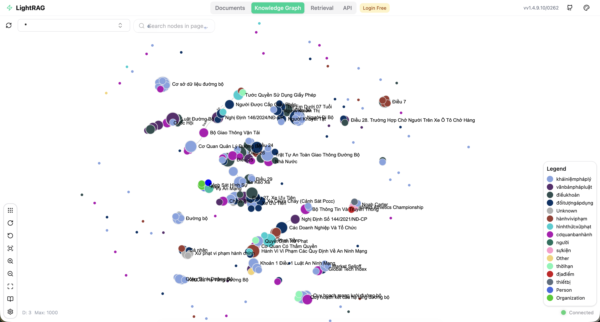
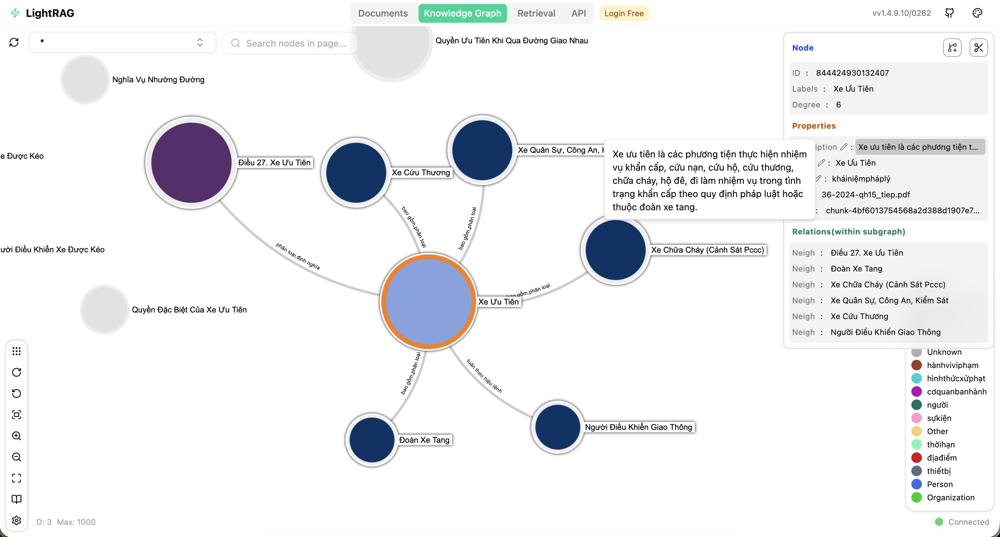
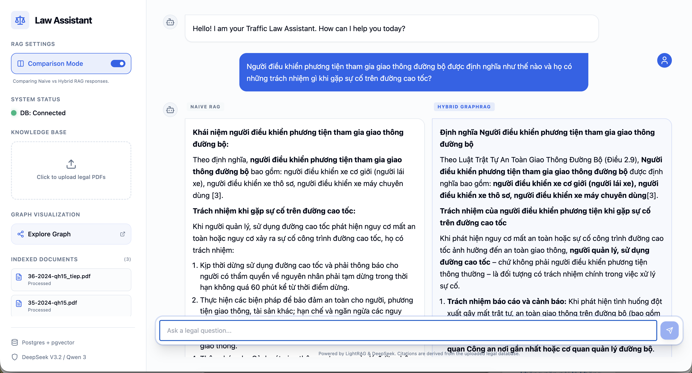
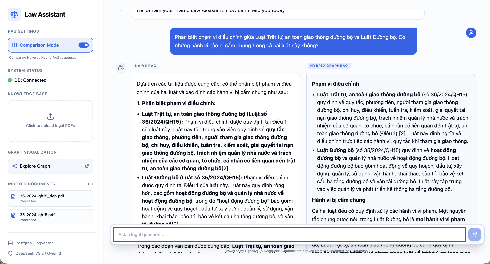
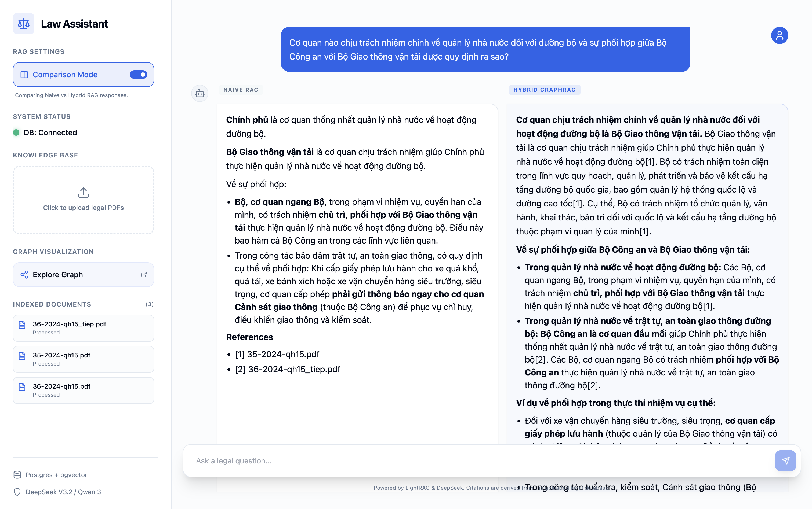
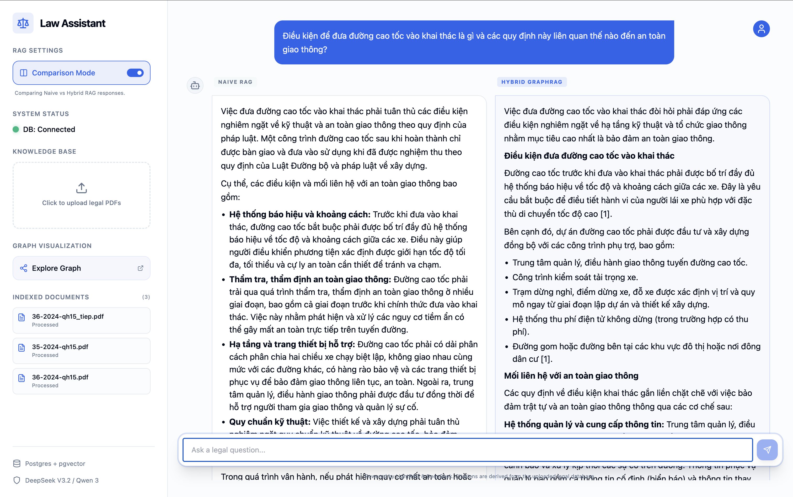
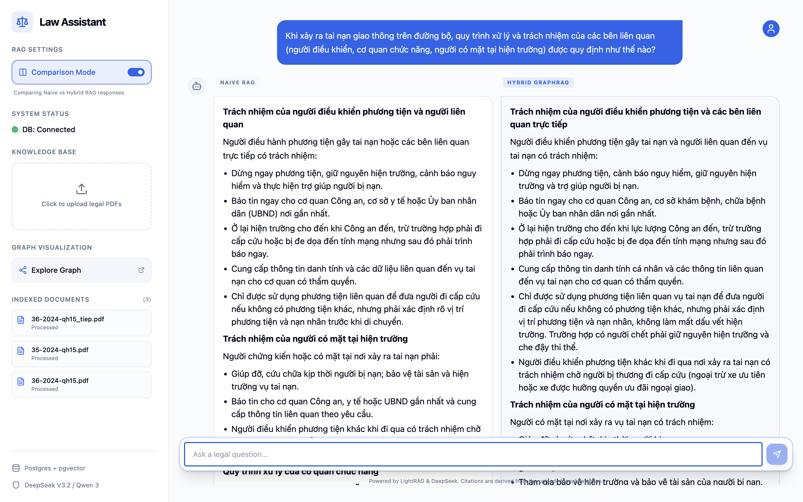

# Traffic Law Assistant (Vietnamese Legal RAG)


An advanced legal document assistant powered by **LightRAG**, localized for Vietnamese law and featuring high-fidelity Knowledge Graph visualization. This project uses **FastAPI** for the backend, **React** for the frontend, and **PostgreSQL (Apache AGE + pgvector)** for graph and vector storage.

## 🚀 Key Features

- **Vietnamese Legal Localization**: Specialized entity extraction for laws (*Điều khoản, Văn bản pháp luật, Cơ quan ban hành*).
- **Vision-Based PDF Parsing**: Uses **Qwen 3 VL** (via OpenRouter) to extract raw legal text from PDFs with absolute fidelity, even for scans.
- **Interactive Knowledge Graph**: Explore legal relationships via the integrated **LightRAG Graph UI** on port 8001.

  
  
- **Comparison Mode**: Side-by-side RAG evaluation with parallel streaming.

  
  
  
  
  
- **Hybrid RAG Retrieval**: Combined vector and graph search for precise legal grounding.
- **Modern Chat Interface**: Beautiful React UI with Markdown support and source citations.
- **Document Inventory**: Manage and track the status of all indexed legal documents.

## 🛠 Tech Stack

- **Backend**: Python 3.11, FastAPI, `lightrag-hku`
- **Frontend**: Vite, React, TypeScript, Tailwind CSS, Shadcn UI
- **Database**: PostgreSQL with `pgvector` (Vector) and `Apache AGE` (Graph)
- **LLM/Embeddings**: DeepSeek V3, Qwen 3 VL, OpenAI Embeddings (via OpenRouter)
- **Deployment**: Docker Compose

## 📦 Getting Started

### Prerequisites

- Docker and Docker Compose
- OpenRouter API Key

### Environment Setup

Create a `.env` file in the root directory (refer to `.env.example`):

```bash
POSTGRES_USER=postgres
POSTGRES_PASSWORD=postgres
POSTGRES_DATABASE=law_assistant
OPENROUTER_API_KEY=your_key_here
LLM_MODEL=deepseek/deepseek-v3.2
EMBEDDING_MODEL=openai/text-embedding-3-small
```

### Running the Application

1. **Start the Infrastructure**:
   ```bash
   docker compose up -d
   ```

2. **Start the Frontend (Locally)**:
   ```bash
   cd frontend
   npm install
   npm run dev
   ```

The application will be available at:
- **Main UI**: `http://localhost:5173`
- **Backend API**: `http://localhost:8000`
- **Graph Visualization**: `http://localhost:8001/webui`

## 🧠 Architecture

The system consists of three main services:
- `db`: Custom Postgres image with vector and graph extensions.
- `backend`: Handles chat, PDF parsing, and document indexing.
- `rag-ui`: Provides the Knowledge Graph visualization interface.

## 🇻🇳 Localization Details

The RAG engine is optimized for Vietnamese:
- `SUMMARY_LANGUAGE`: Set to `Vietnamese`.
- `ENTITY_TYPES`: Custom legal taxonomy including *Hành vi vi phạm, Hình thức xử phạt, Khái niệm pháp lý*.

## 🌍 Recommended Embedding Models

For the best performance with Vietnamese legal text, consider these alternative embedding models:
- **[Qwen3-Embedding-8B](https://huggingface.co/Qwen/Qwen3-Embedding-8B)**: State-of-the-art multilingual embedding model.
- **[GreenNode-Embedding-Large-VN-Mixed-V1](https://huggingface.co/GreenNode/GreenNode-Embedding-Large-VN-Mixed-V1)**: Specialized embedding for Vietnamese language tasks.

> [!NOTE]
> While models like Qwen3 or GreenNode offer superior performance, **OpenAI's `text-embedding-3-small` (1536D)** was chosen as the default for this implementation to stay within the recommended vector dimension limits for efficient **pgvector HNSW indexing** without excessive memory overhead.

---

## 🙏 Acknowledgment

Special shoutout to the **[LightRAG](https://github.com/HKUDS/LightRAG)** project for providing the powerful Graph RAG framework that powers this assistant.

---
Developed as part of the Traffic Legal Assistant project.


---------------------------
TÀI LIỆU: https://tutorial.aivietnam.edu.vn/pdf/48
```bash
  #Xoa toan bo
  docker rm -f $(docker ps -aq) 2>/dev/null
  docker rmi -f $(docker images -aq) 2>/dev/null
  docker system prune -a --volumes -f
  #Build lại image
  docker compose down 
  docker compose up -d --build
  #Build lại image + xoa data
  docker compose down -v
  docker compose up -d --build -V


  #Pull model DeepSeek R1 trong container ollama
  docker compose up -d ollama
  docker compose exec ollama ollama pull deepseek-r1:1.5b
  docker compose exec ollama ollama pull nomic-embed-text
  docker exec -it ollama ollama pull qwen2.5:7b-instruct
  docker compose exec ollama ollama pull bge-m3   
  docker compose exec ollama ollama list

  
  #Khong mat Data
  docker compose down
  docker compose up -d
  docker compose logs -f litellm


  docker restart ollama
  docker exec -it ollama ollama list
```

Hướng A — Muốn GIỮ thay đổi của bạn (an toàn nhất)
B1. Xem đang bẩn gì
git status
B2. Stash lại tất cả (kể cả file untracked như .env)
git stash -u
B3. Pull lại
git pull
B4. Lấy lại thay đổi của bạn (nếu cần)
git stash pop
Nếu stash pop bị conflict (xung đột), Git sẽ báo, bạn mở file lên resolve rồi commit.